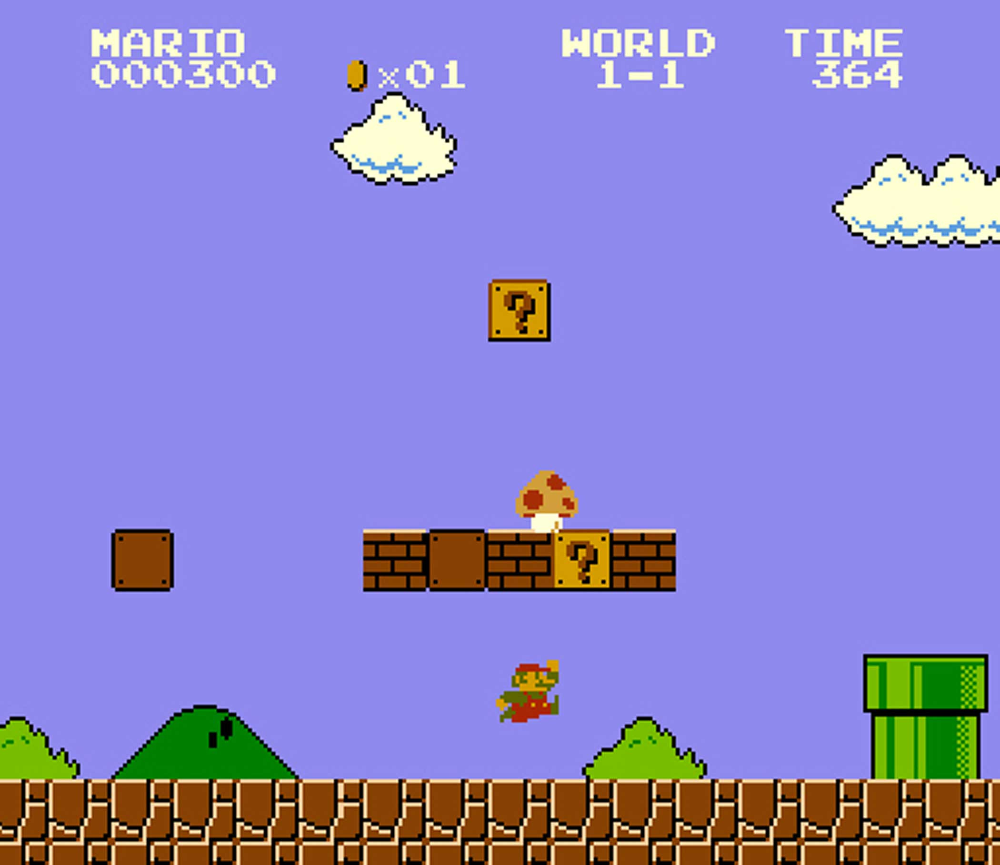

# Project - Super Mario Clone using OpenGL

## Features

**Textures**

**Character Movement**
* Basic: left, right movements; jump
* Additional: dash, brake, dynamic texture

Force (applied, gravity, friction) and velocity calculation

**Object Interaction**
* World-objects: stand on bricks, hit bricks,
collect coins
* Items: mushrooms, super stars
* Enemies: Goombas, Koopas

Impulse forces, box box collisions

**Camera**: Focused on Mario
